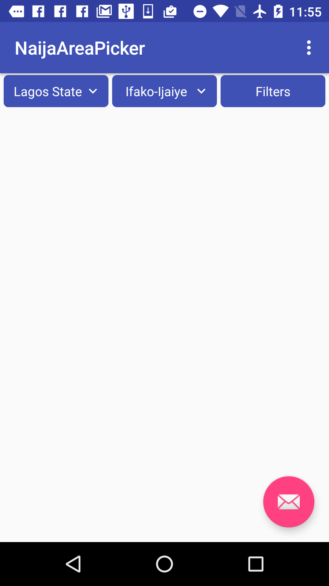
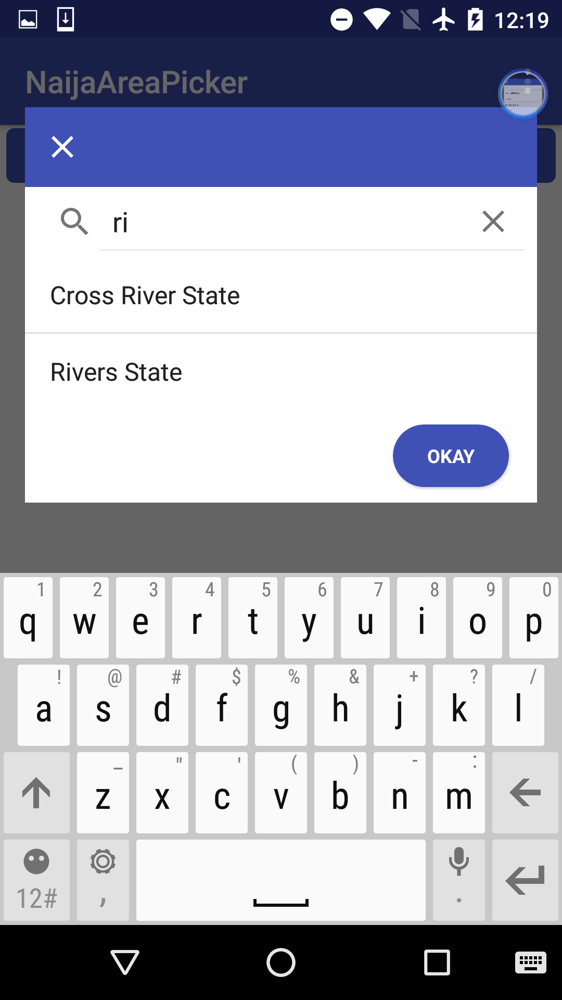
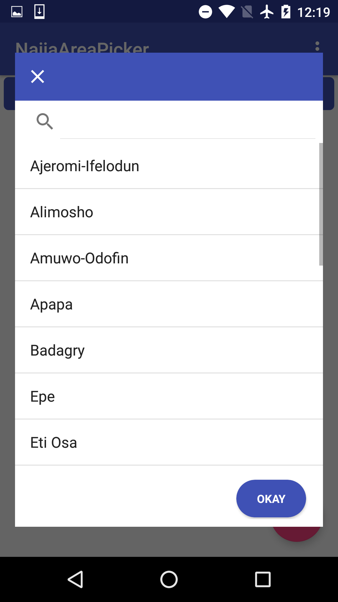
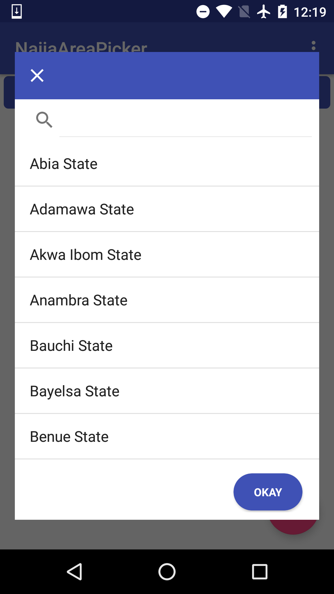

# Naija Area Picker

Library I wrote to ease the process of picking Local Government Areas and States for Nigerian developers … Looks frigging good in an AppBarLayout just under the toolbar .. see them the screenshots for examples.

## Made by a Nigerian Developer for Nigerian Developers …

## Used libraries

— FloatingTextButton : com.github.dimorinny:floating-text-button:0.0.2
- Android Design Libs

## To do
** Write attributes for easier use
** Add ability to remove filters button
** Add ability to remove LGAs button

#How to use

—— In XML:  <com.alium.naijaareapicklib.ui.AreaPicker
        android:id="@+id/area_pucker"
        android:layout_width="match_parent"
        android:layout_height="wrap_content"
         />

—- In activity/fragment: 
	First implement the interfaces: 
	public class TestActivity extends AppCompatActivity implements AreaPicker.OnStateSelected, AreaPicker.OnLGASelected, OnFilterInteractionListener 

	then bind the view
	mAreaPicker = (AreaPicker) findViewById(R.id.area_pucker);
        mAreaPicker.setmOnLGASelected(this);
        mAreaPicker.setmOnStateSelected(this);
        mAreaPicker.setmOnFilterInteractionListener(this);

	Then Go NUTS
	
	 @Override
    	public void onFiltersInteraction(State state, LocalGovernmentArea localGovernmentArea) 	{
        Toast.makeText(this, "STATE: " + state.getName() + " : " + "LGA: " + localGovernmentArea.getName(), Toast.LENGTH_SHORT).show();
   	}

   	 @Override
    	public void onStateSelected(int position, State state) {
        Toast.makeText(this, "STATE: " + state.getName(), Toast.LENGTH_SHORT).show();
    	}

    	@Override
    	public void onLGASelected(int position, LocalGovernmentArea localGovernmentArea) {
        Toast.makeText(this, "LGA: " + localGovernmentArea.getName(), Toast.LENGTH_SHORT).show();

    	}

License
----------------

The MIT License (MIT)

Copyright (c) 2017 Aliu Abdul-Mujib

Permission is hereby granted, free of charge, to any person obtaining a copy
of this software and associated documentation files (the "Software"), to deal
in the Software without restriction, including without limitation the rights
to use, copy, modify, merge, publish, distribute, sublicense, and/or sell
copies of the Software, and to permit persons to whom the Software is
furnished to do so, subject to the following conditions:

The above copyright notice and this permission notice shall be included in all
copies or substantial portions of the Software.

THE SOFTWARE IS PROVIDED "AS IS", WITHOUT WARRANTY OF ANY KIND, EXPRESS OR
IMPLIED, INCLUDING BUT NOT LIMITED TO THE WARRANTIES OF MERCHANTABILITY,
FITNESS FOR A PARTICULAR PURPOSE AND NONINFRINGEMENT. IN NO EVENT SHALL THE
AUTHORS OR COPYRIGHT HOLDERS BE LIABLE FOR ANY CLAIM, DAMAGES OR OTHER
LIABILITY, WHETHER IN AN ACTION OF CONTRACT, TORT OR OTHERWISE, ARISING FROM,
OUT OF OR IN CONNECTION WITH THE SOFTWARE OR THE USE OR OTHER DEALINGS IN THE
SOFTWARE.
